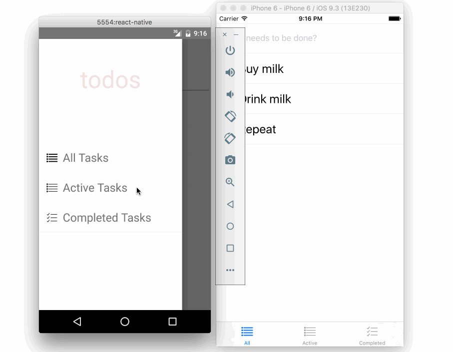
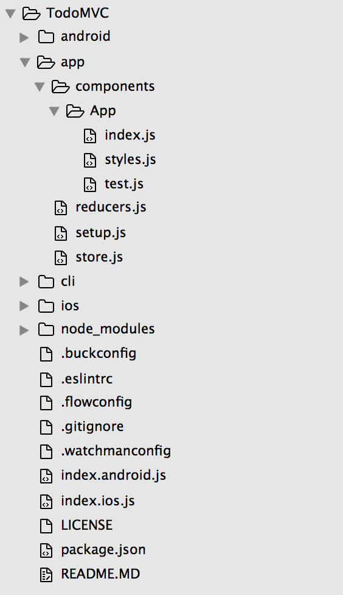
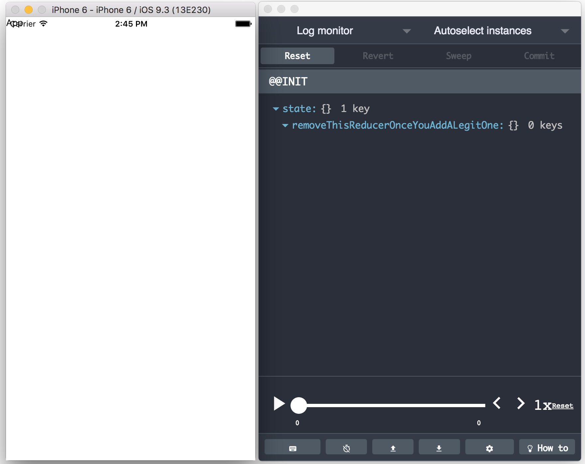
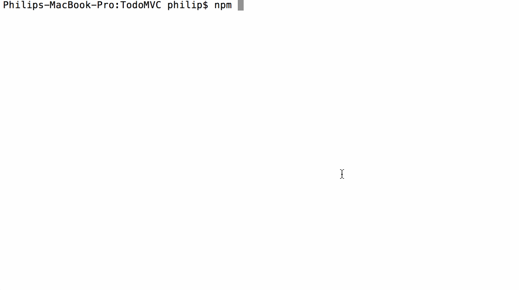
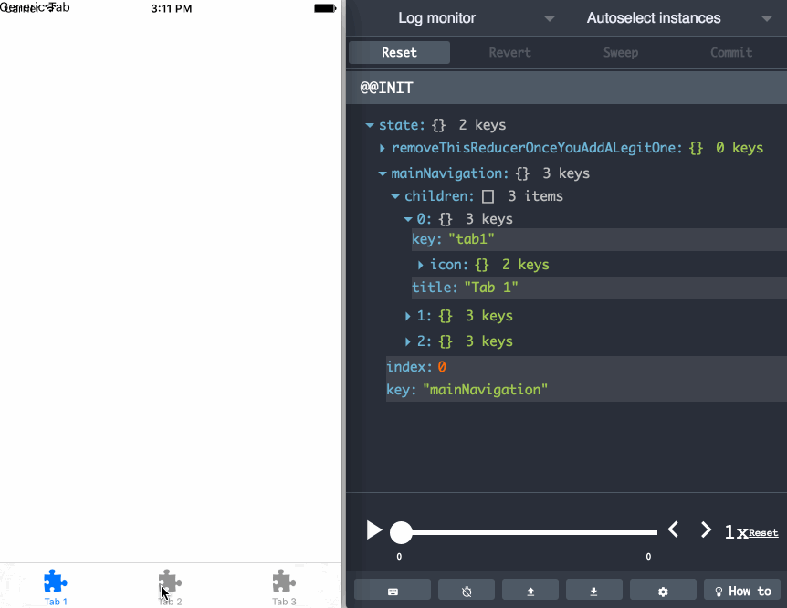
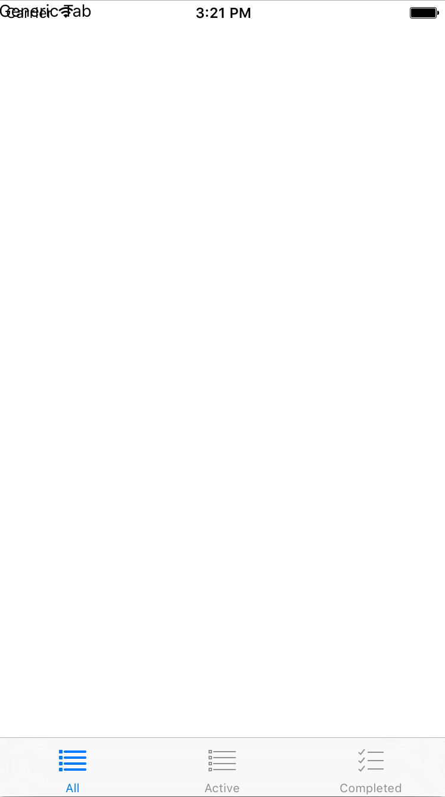
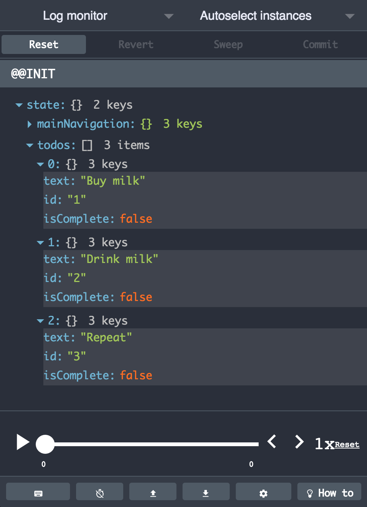

# React Native TodoMVC

[TodoMVC](http://todomvc.com/) using React Native (without persistence for now)



## Quick start


```sh
git clone https://github.com/thebakeryio/todomvc-react-native.git
cd todomvc-react-native && npm install
```

To run the server

```sh
npm run server
```

To run app on iOS/Android emulator

```sh
npm run ios
npm run android
```

**Note** There is sometimes a nasty bug with npm module installs. If you get an error related to a module not being resolved correctly, just rerun npm install so it can pick up missing modules

## Walkthrough 

Before we begin, there are few things you need to know/be comfortable with. This article assumes you already have some experience with React Native and you are also comfortable with the ideas behind [Redux](http://redux.js.org/).

We are using our home made [React Native boilerplate called Baker](https://github.com/thebakeryio/baker) boilerplate for this but you do not have to.

### Getting started

```sh
git clone https://github.com/thebakeryio/baker.git TodoMVC
cd TodoMVC && npm install && npm run setup 
```    

This will set up a basic React Native project in TodoMVC directory - you will be prompted to enter a name of your app.    

### Take a look around 

Let's take a look at the app structure that we have so far



Most of the things in the project root directory are part of the standard React Native structure that you get after running ```react-native init```. Now if you take a closer look to the **/app** directory, you will notice there are already a few additional things in place:

**app/setup.js** is the entry point to the application, the module is used with *index.android.js* and *index.ios.js* in the project root. The module looks like this

```javascript
// app/setup.js

import App from './components/App';
import React, { Component } from 'react';
import { Provider } from 'react-redux';
import configureStore from './store';

const store = configureStore();

function setup() {
  class Root extends Component {
    render() {
      return (
        <Provider store={store}>
          <App />
        </Provider>
      );
    }
  }

  return Root;
}

module.exports = setup;
```

If you are familiar with [Redux](http://redux.js.org/), this should look fairly straighforward: we are connecting application store to the React component tree in our application

**app/reducers.js** is responsible for composing all the application reducers and making them available to the rest of the application

```javascript
// app/reducers.js

import { combineReducers } from 'redux-immutable';

// XX: Do not rename this variable if you want reducer generator
// to keep working properly (and you do want that, right?)
const applicationReducers = {
  removeThisReducerOnceYouAddALegitOne: () => ({}),
};

export default function createReducer() {
  return combineReducers(applicationReducers);
}
```

Notice that the Baker includes a pretty useless reducer called ```removeThisReducerOnceYouAddALegitOne``` for you to start with. We will see later how app/reducer.js module is automatically kept in sync when you are using generators to add containers to the app.  
 
```sh
npm run ios
```

Finally, a quick look at **app/store.js**

```javascript
// app/store.js

import { createStore, compose } from 'redux';
import { fromJS } from 'immutable';
import createReducer from './reducers';
import devTools from 'remote-redux-devtools';

function configureStore(initialState = fromJS({})) {
  if (__DEV__) {
    const createStoreWithMiddleware = compose(devTools())(createStore);
    return createStoreWithMiddleware(createReducer(), initialState);
  } else {
    return createStore(createReducer(), initialState);
  }
}

module.exports = configureStore;
```

This is where our app's store comes to life taking advantage of the reducers we've seen in *app/reducers.js* as well as some additional middleware (and we'll see how it's useful in a second).

Let's run the app and see what it looks like at this point

```
npm run ios
# or you can also do: npm run android
```



At this point we have a pretty useless application up and running. Notice we also have a super useful [Remote Redux Devtools](https://chrome.google.com/webstore/detail/redux-devtools/lmhkpmbekcpmknklioeibfkpmmfibljd?hl=en) running next to the app showing us what is going on with the application state. Remember that middleware we added to the store just a few minutes ago - that is what enabled us to have this great sneak peak into our app's inner workings.  

### Adding navigation

I wrote extensively about experimental navigation in React Native [here](http://blog.thebakery.io/react-native-experimental-navigation-with-redux/).

Once again, Baker (the boilerplate and generator system we are using) allows us to scaffold the entire navigation chunk with a single command:



This will generate a bunch of files to plug in Tab based navigation into the. Let's reload the app in the simulator and take a look

  

Head to **app/components/MainNavigation/reducer.js** and let's make tabs more relevant to our Todos application:

```javascript
import  { NavigationExperimental, Platform } from 'react-native';
const { Reducer: NavigationReducer } = NavigationExperimental;

const tabsDefinitions = [
  {
    key: 'all',
    icon: require('./images/all.png'),
    title: Platform.select({ ios: 'All', android: 'All Tasks' })
  },
  {
    key: 'active',
    icon: require('./images/active.png'),
    title: Platform.select({ ios: 'Active', android: 'Active Tasks' })
  },
  {
    key: 'completed',
    icon: require('./images/completed.png'),
    title: Platform.select({ ios: 'Completed', android: 'Completed Tasks' })
  }
];

const _mainNavigation = NavigationReducer.TabsReducer({
  key: 'mainNavigation',
  initialIndex: 0,
  tabReducers: tabsDefinitions.map(t => (lastRoute) => lastRoute || t),
});

const mainNavigation = (state, action) => {
  if (action.scope && action.scope !== 'mainNavigation') {
    return state;
  } else {
    return _mainNavigation(state, action);
  }
};

export default mainNavigation;

export function selectMainNavigation(state) {
  return state.get('mainNavigation');
}  
```

Our application looks like this now



### Creating TodoList container

Let's move on to the core of the TodoMVC application - The List. We are gonna use a container generator to create a **TodoList** container using ```npm run generate```. Start by defining **todos** reducer that will be responsible managing interactions with todos items 

```javascript
import { fromJS } from 'immutable';
import { TOGGLE_TASK_COMPLETION, ADD_TASK, DELETE_TASK } from './constants';

const initialState = fromJS([
  { text:'Buy milk', id: '1', isComplete: false },
  { text:'Drink milk', id: '2', isComplete: false  },
  { text:'Repeat', id:'3', isComplete: false  }
]);

function todos(state = initialState, action) {
  switch (action.type) {
    case TOGGLE_TASK_COMPLETION:
      const itemIndex = state.findIndex( i => i.get('id') === action.payload.id);
      if (itemIndex !== -1) {
        return state.update(itemIndex, (i) => i.updateIn(['isComplete'], ic => !ic));
      }
      return state;
    case ADD_TASK:
      return state.push(fromJS({
        text: action.payload.text,
        id: new Date().getTime().toString(),
        isComplete: false
      }));
    case DELETE_TASK:
      return state.filter(todo => todo.get('id') !== action.payload.id);
    default:
      return state;
  }
}

export default todos;

export function selectAllTodos(state) {
  return state.get('todos');
}

export function selectCompletedTodos(state) {
  return state.get('todos').filter(todo => todo.get('isComplete'));
}

export function selectActiveTodos(state) {
  return state.get('todos').filter(todo => !todo.get('isComplete'));
}
```

In addition to defining the main reducer function, we are also exposing additional selectors that we can use in the component to select parts of the application state. Let's take a look at the application state:



With *todos* in store, we can now focus on the TodoList container item in **app/components/TodoList/index.js**

```javascript
import { View, ListView } from 'react-native';
import React, { Component, PropTypes } from 'react';
import styles from './styles';

import { connect } from 'react-redux';
import { createSelector } from 'reselect';
import { selectAllTodos, selectActiveTodos, selectCompletedTodos } from './reducer';
import { toggleTaskCompletion, deleteTask } from './actions';
import NoTodos from '../NoTodos';
import TodoItem from '../TodoItem';

class TodoList extends Component {
  render() {
    return (
      <View style={ styles.container }>
        {this._renderList()}
      </View>
    );
  }

  _renderList() {
    if (this.props.todos.size !== 0) {
      var ds = new ListView.DataSource({rowHasChanged: (r1, r2) => r1 !== r2});
      return (
        <ListView dataSource={ds.cloneWithRows(this.props.todos.toJS())}
          renderRow={this._renderRow.bind(this)} />
      );
    } else {
      return (
        <NoTodos />
      );
    }
  }

  _renderRow (todo) {
    return (
      <TodoItem todo={todo}
        key={todo.id}
        onDelete={this.props.deleteTask}
        onToggleCompletion={this.props.toggleCompletion} />
    );
  }
}

TodoList.propTypes = {
  todos: PropTypes.object.isRequired,
  filter: PropTypes.string.isRequired
};

function mapDispatchToProps(dispatch) {
  return {
    dispatch,
    toggleCompletion (id) {
      dispatch(toggleTaskCompletion(id));
    },
    deleteTask (id) {
      dispatch(deleteTask(id));
    }
  };
}

function getSelector(state, props) {
  const filterToSelector = {
    'all': selectAllTodos,
    'completed': selectCompletedTodos,
    'active': selectActiveTodos
  };
  return createSelector(filterToSelector[props.filter], (todos) => ({ todos }))(state, props);
}

export default connect(getSelector, mapDispatchToProps)(TodoList);

```

We are gonna take a look at **TodoItem** component in a minute. Meanwhile notice that our TodoList container is parameterized using **filter** property that can have one of the following values: *all*, *completed*, *active*. These map nicely to 3 different tabs we've defined in the application. **getSelector** function returns an appropriate selector that we have previously defined in the TodoList reducer module.

### Defining TodoItem component

To generate an empty component for the application, we are gonna use ```npm run generate``` again, choose Component option and call the new component *TodoItem*

```javascript
import { View, Text, TouchableOpacity, Image } from 'react-native';
import React, { Component, PropTypes } from 'react';
import styles from './styles';
import Swipeout from 'react-native-swipeout';

class TodoItem extends Component {
  render() {
    const swipeoutBtns = [{
      text: 'Delete',
      backgroundColor: 'red',
      onPress: () => {
        this.props.onDelete(this.props.todo.id);
      }
    }];
    const viewCompletedStyling = this.props.todo.isComplete ? { opacity: 0.5 } : {};
    const labelCompletedStyling = this.props.todo.isComplete ? { textDecorationLine: 'line-through' } : {};

    return (
      <Swipeout right={swipeoutBtns} backgroundColor={'transparent'}>
        <TouchableOpacity
          underlayColor="transparent"
          onPress={ () => this.props.onToggleCompletion(this.props.todo.id) }>
          <View style={[styles.item, viewCompletedStyling]}>
            {this._renderCheckbox()}
            <View style={styles.labelWrapper}>
              <Text style={[styles.label, labelCompletedStyling]}>{this.props.todo.text}</Text>
            </View>
          </View>
        </TouchableOpacity>
      </Swipeout>
    );
  }

  _renderCheckbox() {
    const imageModule = this.props.todo.isComplete ?
      require('./images/checked.png') :
      require('./images/unchecked.png');

    return  (
      <Image style={[styles.checkbox]} source={imageModule} />
    );
  }
}

TodoItem.propTypes = {
  todo: PropTypes.object.isRequired,
  onToggleCompletion: PropTypes.func.isRequired,
  onDelete: PropTypes.func.isRequired
};

export default TodoItem;

```

TodoItem component is parameterized with a *todo* object and 2 callbacks *onToggleCompletion* and *onDelete*. These get passed down from **TodoList** container that connects it directly via Redux *dispatch*.

### Creating AddTodoItem container

One final missing part is a way to add todos in the application. We are gonna add a simple container responsible for capturing input and creating a new todo item using *addTask* action defined earlier inside TodoList actions module

```javascript
import { TextInput } from 'react-native';
import React, { Component } from 'react';
import styles from './styles';
import { connect } from 'react-redux';
import { addTask } from '../TodoList/actions';

class AddTodoItem extends Component {
  render() {
    return (
      <TextInput
        ref={ input => { this._textBox = input; } }
        autoCorrect={false}
        placeholder={ 'What needs to be done?' }
        style={ styles.textBox }
        onChangeText={(text) => this.setState({ text })}
        onSubmitEditing={this.saveTodoItem.bind(this)}
      />
    );
  }

  saveTodoItem () {
    this.props.addTask(this.state.text);
    this._textBox.clear();
  }
}

function mapDispatchToProps(dispatch) {
  return {
    dispatch,
    addTask (text) {
      dispatch(addTask(text));
    }
  };
}

export default connect(() => ({}), mapDispatchToProps)(AddTodoItem);
```   

### Putting it all together

Let's start by updating *MainNavigation* container to render appropriate versions of TodoList containers based on the currently selected tab:

```javascript
class MainNavigation extends Component {
  render() {
    const children = this.props.mainNavigation.children.map( (tab, i) => {
      return (
        <TabBarIOS.Item key={tab.key}
            icon={tab.icon}
            selectedIcon={tab.selectedIcon}
            title={tab.title} onPress={
              () => this.props.onNavigate(JumpToAction(i))
            }
            selected={this.props.mainNavigation.index === i}>
            { this._renderTabContent(tab) }
        </TabBarIOS.Item>
      );
    });
    return (
      <TabBarIOS>
        {children}
      </TabBarIOS>
    );
  }

  _renderTabContent(tab) {
    return (
      <View style={ styles.container }>
        <TodoList filter={tab.key} />
      </View>
    );
  }
}
```

Notice how *_renderTabContent* is responsible for rendering an instance of *TodoList* container passing along a *filter* prop corresponding to the key of the current tab.

AddTodoItem is wired on the top level in the App component

```javascript
import { View, Platform } from 'react-native';
import React, { Component } from 'react';
import styles from './styles';
import MainNavigation from '../MainNavigation';
import AddTodoItem from '../AddTodoItem';

class App extends Component {
  render() {
    return (
      <View style={ styles.container }>
        { Platform.OS === 'ios' ? <AddTodoItem /> : null }
        <MainNavigation />
      </View>
    );
  }
}


export default App;
``` 

Notice the usage of *Platform.OS* utility to only render *AddTodoItem* component when running on ios. There are a few minor adjustments that we had to perform (not mentioned in this article) to make sure the Android version of the app looks natural on Android - all the code for both version of the app is included in the [example repository](https://github.com/thebakeryio/todomvc-react-native)

# Conclusion

This was the first time I've built a fairly simple application using RN (React Native) and it was a lot of fun. I found the tooling to be very nice and helpful. If you understand and like React, RN feels natural. This article is not meant as a shameless plug for our in-house RN boilerplate called [Baker](https://github.com/thebakeryio/baker) but rather a showcase of how one can achieve significant improvement in productivity and happiness with a sane boilerplate+generator combo. Next time you are about to storm out to write an article about JavaScript fatigue, maybe you could write a [Yeoman based generator](http://yeoman.io/authoring/) instead and share it with others.

I'll be doing a followup post on this TodoMVC example to add a pesistence layer to the application. 

# Links

- [Source code for this example](https://github.com/thebakeryio/todomvc-react-native)
- [Yeoman based RN generator by The Bakery](https://github.com/thebakeryio/generator-rn)
- [Baker RN boilerplace by The Bakery](https://github.com/thebakeryio/baker)
- [Max Stoiber's React Boilerplate](https://github.com/mxstbr/react-boilerplate), inspiration for Baker
- [Follow us on Twitter for more goodness](https://twitter.com/bakeryhq)