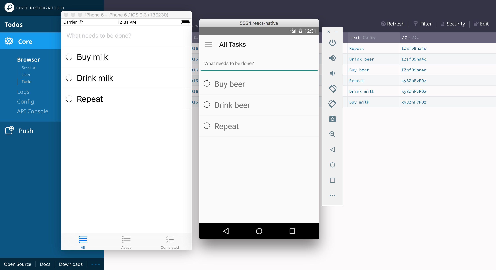

⚠️ This app has been migrated away from the original stack described in the [article](http://blog.thebakery.io/todomvc-with-react-native-and-redux/) to using [Apollo Stack](http://www.apollodata.com/) for data management. Followup article coming up ⚠️

# TodoMVC: React Native + Parse Server + Apollo Stack  

[TodoMVC](http://todomvc.com/) using React Native with Parse Server persistence layer

[](https://www.bitrise.io/app/8cf4360e8c7dc8b3)



## Quick start


```sh
git clone https://github.com/thebakeryio/todomvc-react-native.git
cd todomvc-react-native && npm install
```

To run the server

```sh
cd server
npm run server
```

To run app on iOS/Android emulator

```sh
cd app
npm run ios
npm run android
```

## What's included

- React Native based mobile client (iOS + Android)
- Redux + Sagas for state management and sync
- Parse Server + Parse Server Dashboard + GraphQL Instance

## Configuration

All the settings are located in /settings
